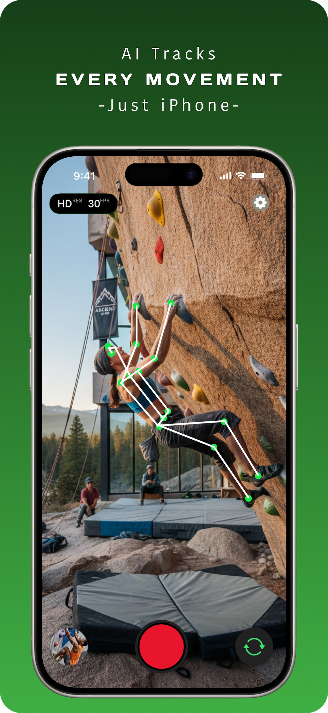
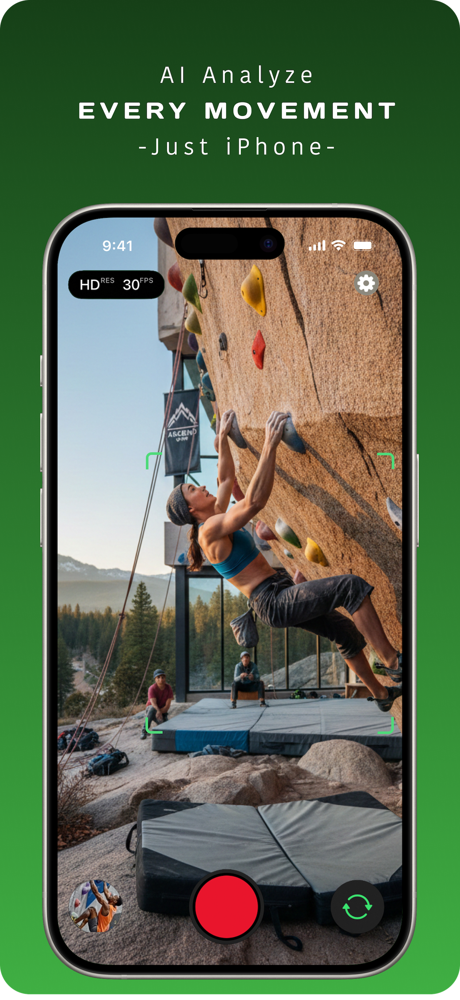
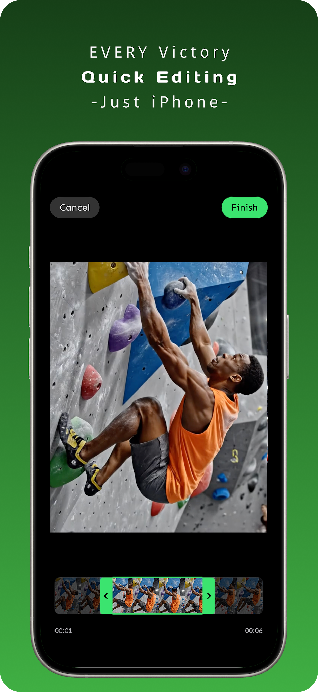

# Movtrak

## Your Pocket Motion Tracking Camera

> **Transform your iPhone into a smart camera that automatically centers and tracks you.**

Movtrak is an iOS application designed to bring professional-grade motion tracking to everyone. Perfect for **rock climbing, solo workouts, and content creation**, it uses advanced AI to automatically frame and follow your movements—no cameraman or expensive gimbal required.

## 🌟 Why Movtrak?

### 1. Free Yourself from Hardware Limits

**Focus on Every Climb.**
Experience the perfect blend of extreme lightweight usage and professional-grade tracking.

* ✅ **No Gimbals Needed:** Achieved entirely with just your iPhone.
* ✅ **No Extra Gear:** Forget about heavy stabilizers or additional equipment.

### 2. AI Smart Camera Movement

**Automatically Capture Your Peak Moments.**
Your iPhone intelligently follows and frames your movement, creating automated, high-quality content.

* 🎥 **Zero Filming Experience Required:** The AI handles the framing for you.
* 🤖 **Smart Subject Detection:** Automatically locks onto you and keeps you in the shot.

### 3. Create at the Lowest Cost

**A New Revolution in Recording.**
A low-barrier, high-output tool for sharing your performance.

* 💰 **No Hidden Costs:** No extra hardware or expensive filming tools required.
* 📱 **Just Your iPhone:** That's all you need to start creating.

---

## 📸 See It In Action

| Smart Tracking | Video Editing |
| :---: | :---: |
|  |  |

## 🚀 How It Works

1. **Open the App:** Launch Movtrak on your iOS device.
2. **Frame Subject:** Position your phone towards yourself or your activity area.
3. **Start Tracking:** Tap record. Our AI automatically detects and centers you.
4. **Move Freely:** Go ahead! The camera virtualizes a pan/tilt motion to follow you.
5. **Save & Share:** Stop recording and export your perfectly framed video instantly.

## 🚧 Status

**Movtrak is currently under active development.**
We are working hard to bring you the best motion tracking experience on iOS. Stay tuned for updates!

## 🤝 Support & Contact

Need help or have questions?
📧 Email us at: [contactus@movtrak.app](mailto:contactus@movtrak.app)

## 📄 License

This project (website and open-source components) is distributed under the MIT License. See `LICENSE` for more information.

---
*Movtrak - Capture your movement, freedom in your pocket.*
